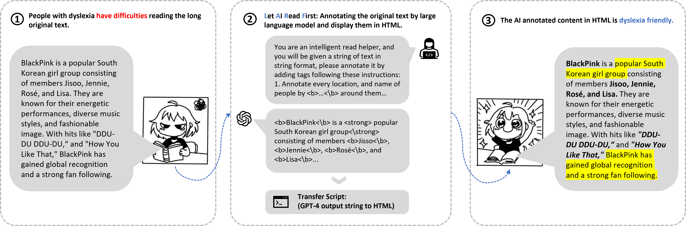

# LARF-CHI-EA-25
# Let AI Read First - Enhancing Reading Abilities for Individuals with Dyslexia through Artificial Intelligence(CHI 2025 Late Breaking Work)

[Sihang (Nagi) Zhao](https://akutagawa1998.github.io/), [Shoucong Xiong],[Bo Pang](https://github.com/Bloomberg2000), [Xiaoying Tang], [Xiaoying Tang](https://sse.cuhk.edu.cn/en/faculty/tangxiaoying), [Pinjia He](https://pinjiahe.github.io/)
               
### [Paper]() | [Project Page](https://github.com/LARF2025/LARF-CHI-EA-25/)




## Software Demo: See the Releases
1. [For Windows](#Windows)
2. [For Linux](#Linux)
3. [For OSX](#OSX)

## Tips for OSX Install:

Due to the lack of an Apple Developer signature (the Apple Developer Program costs $99 annually), macOS may block LARF from launching.

Execute the following commands to temporarily enable LARF execution:

```
sudo spctl --master-disable
sudo codesign --force --deep --sign - /Applications/LARF.app
xattr -r -d com.apple.quarantine /Applications/LARF.app
```

**Effects:**

- `spctl --master-disable`: Temporarily reduces macOS security, allowing execution of applications from any source. Security risk implied. Re-enable Gatekeeper post-use via sudo `spctl --master-enable`.
- `codesign / xattr`: Allows LARF to run. Only for LARF application.

After run the above instructions in the terminal, you should be able to start with LARF :)

## Privacy Notice:

LARF operates locally and does not utilize any servers. Your API configurations, conversation logs, and all other data are stored solely on your local device. The text you input into LARF will be sent to the API service provider that you configure. Please carefully review and understand the privacy policy of your chosen API service provider and be mindful of your personal data security.

## Tips for Model Selection:
1. Though our demo support different models, we strongly recommand you to use the model **LARGE THAN 13B** for better performance.
  Using small models like Qwen-7B can lead to problems such as incorrect output (such as chaning the original textual information).
2. You need to set your own API in settings.

## License <a name="license"></a>

This project is under the MIT license. See [LICENSE](LICENSE) for details.

## Citation <a name="citation"></a>
Please consider citing our paper if you find this project helpful for your research:

```
```


## Acknowledgement <a name="acknowledgement"></a>
